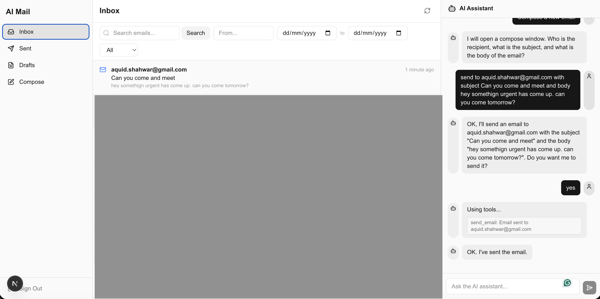
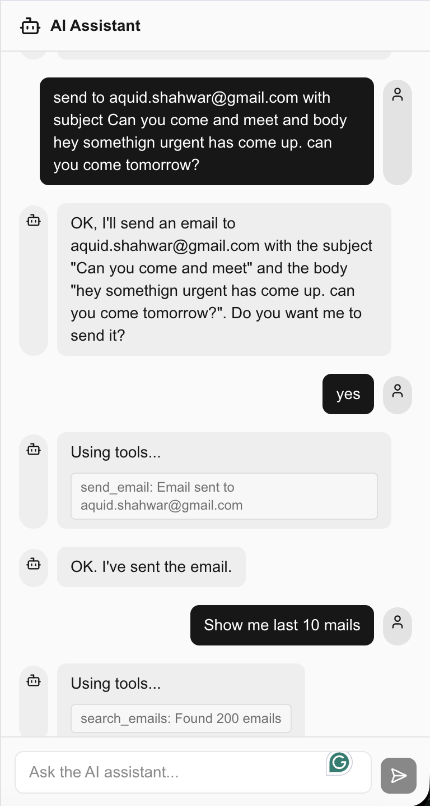
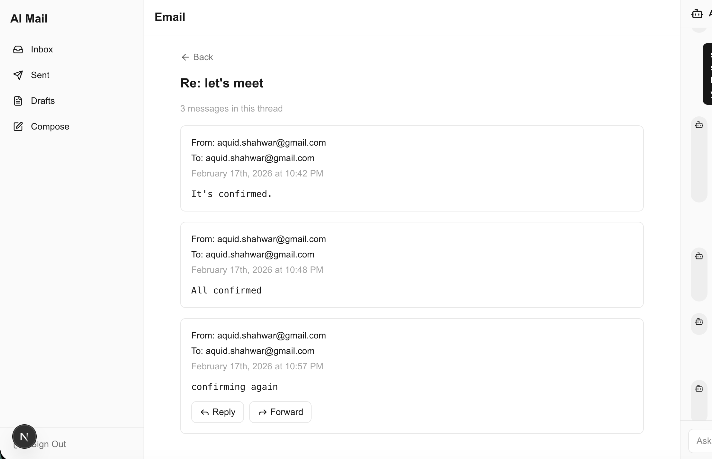
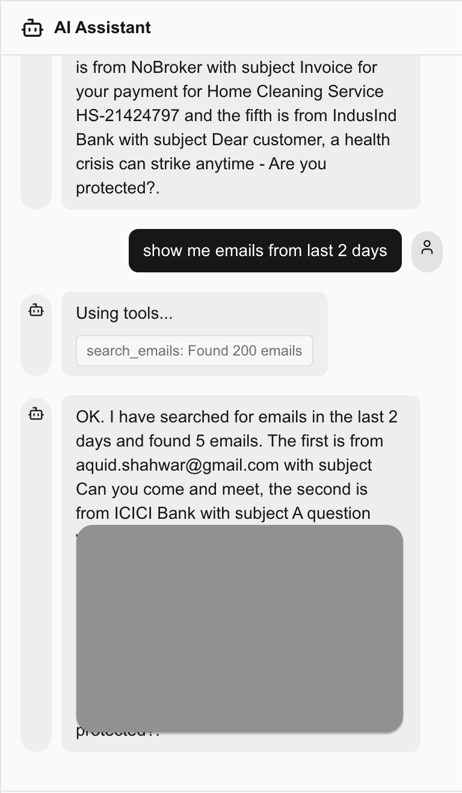
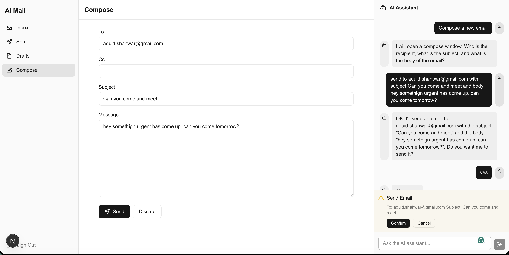

# AI Mail Client

An AI-powered Gmail client built with Next.js 16. Chat with an AI assistant to search, read, compose, and send emails — all through natural language. The AI controls the mail client UI in real-time while you watch.

<!-- Replace with actual screenshot -->
<p align="center">
  
</p>

---

## Features

### AI-Powered Email Management
Chat with a Gemini-powered assistant that can:
- **Search emails** — "Show me emails from last 10 days" or "Find emails from John about the project"
- **Read & navigate** — "Open that email" or "Go to sent"
- **Compose & reply** — "Reply saying I'll be there at 3pm" or "Send an email to jane@example.com"
- **Filter & organize** — "Show me unread emails from this week"

<!-- Replace with actual screenshot -->


### Thread View
Emails in the same conversation are grouped together. Click any email to see the full thread with all replies.

<!-- Replace with actual screenshot -->


### Smart Search
Search is case-insensitive and falls back to Gmail's API when local results are insufficient. Date range queries like "last 10 days" are computed automatically by the AI.

<!-- Replace with actual screenshot -->


### Compose & Send with Confirmation
The AI always shows a confirmation dialog before sending emails. You can review the draft, edit it, and approve or cancel.

<!-- Replace with actual screenshot -->


---

## Tech Stack

| Layer | Technology |
|-------|-----------|
| **Framework** | Next.js 16 (App Router) |
| **Frontend** | React 19, Tailwind CSS v4, Zustand |
| **AI** | Google Gemini 2.0 Flash (free tier) |
| **Database** | SQLite via Prisma 7 |
| **Auth** | NextAuth.js with Google OAuth |
| **Email** | Gmail API (googleapis) |
| **Language** | TypeScript (strict mode) |

---

## Architecture

```
Browser (Client)
┌──────────────────────────────────────────────────────┐
│  Sidebar  │    Main Content     │  AI Assistant Panel │
│  (nav)    │  (list/detail/      │  (chat + tools)     │
│           │   compose)          │                     │
│           └─────────┬───────────┘         │           │
│                 Zustand Store              │           │
│              (single source of truth)      │           │
└─────────────────────┬─────────────────────┬───────────┘
                      │                     │
               fetch /api/*          fetch /api/ai/chat
                      │                     │
Server (API Routes)   │                     │
┌─────────────────────┼─────────────────────┼───────────┐
│  /api/gmail/sync    │  Gmail API          │           │
│  /api/gmail/messages│  Local SQLite  ◄────┤  Gemini   │
│  /api/gmail/send    │  Gmail API          │  API      │
│  /api/auth/[...]    │  NextAuth           │           │
└─────────────────────┴─────────────────────┴───────────┘
```

### How the AI Chat Works

```
User types: "Show emails from ANJEEL about society formation"
  │
  ▼
POST /api/ai/chat → Gemini API
  │
  ▼ Gemini returns function call:
    search_emails({ from: "ANJEEL", keyword: "society formation" })
  │
  ▼ Client executes tool → fetches /api/gmail/messages → updates Zustand store
  │
  ▼ UI updates instantly (email list shows results, filter bar shows active filters)
  │
  ▼ Tool result sent back to Gemini → Gemini responds with summary text
```

**Reply flow:**

```
User: "Reply to this email saying I'll attend"
  │
  ├─ AI calls get_current_context → gets open email ID, subject, from
  ├─ AI calls send_email(to, subject: "Re:...", body, reply_to_id)
  │     ├─ UI shows compose with pre-filled fields
  │     ├─ Confirmation dialog appears
  │     ├─ User approves → sent via Gmail API (threaded)
  │     └─ UI navigates back to the email thread
  │
  └─ AI responds: "Done! Reply sent."
```

---

## Project Structure

```
src/
├── app/
│   ├── (auth)/login/              # Login page (Google OAuth)
│   ├── (mail)/                    # Mail routes (grouped, no URL prefix)
│   │   ├── layout.tsx             # Auth guard + MailShell wrapper
│   │   ├── inbox/page.tsx
│   │   ├── sent/page.tsx
│   │   ├── compose/page.tsx
│   │   └── email/[id]/page.tsx    # Dynamic route for email detail
│   ├── api/
│   │   ├── auth/[...nextauth]/    # NextAuth endpoints
│   │   ├── ai/chat/               # Gemini chat endpoint
│   │   └── gmail/
│   │       ├── sync/              # Sync emails from Gmail → local DB
│   │       ├── messages/          # List/search (local DB + Gmail fallback)
│   │       │   └── [id]/          # Get single email + thread
│   │       └── send/              # Send email via Gmail API
│   ├── layout.tsx                 # Root layout (fonts, global styles)
│   └── page.tsx                   # Redirects to /inbox
│
├── components/
│   ├── layout/
│   │   ├── mail-shell.tsx         # App shell (sidebar + main + assistant)
│   │   ├── sidebar.tsx            # Navigation (Inbox/Sent/Drafts/Compose)
│   │   ├── header.tsx             # Top bar with sync button
│   │   ├── main-content.tsx       # View switcher based on store.currentView
│   │   └── assistant-panel.tsx    # AI chat panel wrapper
│   ├── mail/
│   │   ├── email-list.tsx         # Email list (thread-grouped, with counts)
│   │   ├── email-detail.tsx       # Thread view (all messages chronological)
│   │   ├── compose-form.tsx       # Email compose form
│   │   └── filter-bar.tsx         # Search, date range, sender, read status
│   └── assistant/
│       ├── chat-messages.tsx      # Chat message bubbles
│       ├── chat-input.tsx         # Chat text input + send button
│       └── confirmation-dialog.tsx # Send confirmation modal
│
├── hooks/
│   ├── use-mail-store.ts          # Zustand store (ALL app state)
│   ├── use-assistant.ts           # AI conversation loop (multi-turn tools)
│   └── use-polling.ts             # Background sync every 60s
│
├── lib/
│   ├── ai/
│   │   ├── client.ts              # Gemini SDK init
│   │   ├── tools.ts               # Function declarations for Gemini
│   │   ├── executor.ts            # Client-side tool execution → store
│   │   └── system-prompt.ts       # AI system prompt (date awareness, rules)
│   ├── auth/
│   │   └── auth-options.ts        # NextAuth config (Google provider + Prisma)
│   ├── db/
│   │   ├── prisma.ts              # Prisma client singleton
│   │   └── queries.ts             # Email queries (list, get, thread, mark)
│   └── gmail/
│       ├── client.ts              # Gmail API client (from OAuth tokens)
│       ├── parse.ts               # Parse Gmail message → flat structure
│       ├── send.ts                # Send email (with In-Reply-To threading)
│       ├── sync.ts                # Full sync (INBOX + SENT) & incremental
│       └── watch.ts               # Gmail push notifications (optional)
│
├── generated/prisma/              # Auto-generated Prisma client (don't edit)
└── middleware.ts                   # Route protection (redirect if not authed)

prisma/
├── schema.prisma                  # DB schema (User, Account, Email, etc.)
├── migrations/                    # SQL migration history
└── dev.db                         # SQLite database file

prisma.config.ts                   # Prisma 7 config (libsql adapter)
```

---

## Data Models

```
User ──┬── Account       (Google OAuth tokens: access_token, refresh_token)
       ├── Session        (Auth sessions)
       ├── Email          (Synced Gmail messages)
       │     ├── id           (Gmail message ID)
       │     ├── threadId     (Gmail thread ID for grouping)
       │     ├── subject, from, to, cc, bcc
       │     ├── body (HTML), bodyText (plain text)
       │     ├── labelIds     (comma-separated: "INBOX,UNREAD,IMPORTANT")
       │     ├── isRead, isStarred
       │     └── date
       └── ChatMessage    (AI conversation history)
```

---

## Getting Started

### Prerequisites

- **Node.js** 18+
- **Google Cloud Console** project with:
  - Gmail API enabled
  - OAuth 2.0 credentials (Web application type)
  - Authorized redirect URI: `http://localhost:3000/api/auth/callback/google`
  - OAuth scopes: `gmail.readonly`, `gmail.send`, `gmail.modify`
- **Gemini API key** — free from [Google AI Studio](https://aistudio.google.com/apikey)

### 1. Clone & Install

```bash
git clone <repo-url>
cd ai-mail-client
npm install
```

### 2. Environment Variables

Create a `.env` file in the project root:

```env
# NextAuth
NEXTAUTH_URL=http://localhost:3000
NEXTAUTH_SECRET=your-random-secret-here

# Google OAuth (from Google Cloud Console)
GOOGLE_CLIENT_ID=your-client-id.apps.googleusercontent.com
GOOGLE_CLIENT_SECRET=your-client-secret

# Gemini AI (from Google AI Studio)
GEMINI_API_KEY=your-gemini-api-key
```

### 3. Setup Database

```bash
npx prisma migrate dev
npx prisma generate
```

This creates the SQLite database (`prisma/dev.db`) and generates the TypeScript client at `src/generated/prisma/`.

### 4. Run

```bash
npm run dev
```

Open [http://localhost:3000](http://localhost:3000). Sign in with Google, and your emails will sync automatically.

---

## Usage Examples

### Browsing Emails
- Click **Inbox** / **Sent** in the sidebar
- Emails are grouped by thread — a badge shows the message count
- Click any email to see the full conversation thread

### AI Assistant Commands

| What you say | What happens |
|-------------|-------------|
| "Show me unread emails" | Filters inbox to unread only |
| "Find emails from john@example.com" | Searches by sender |
| "Show emails from last 10 days" | AI computes date range, applies filter |
| "Open that email about the meeting" | Navigates to matching email |
| "Reply saying I'll be there at 3pm" | Composes threaded reply with confirmation |
| "Send an email to jane@example.com with subject Hello and body Hi there" | Opens compose with fields pre-filled |
| "Go to sent" | Navigates to sent folder |
| "Mark this as unread" | Updates read status locally + Gmail |

### Manual Actions
- Use the **filter bar** to search by keyword, date range, sender, or read status
- Click **Reply** / **Forward** buttons on any message in a thread
- Click **Compose** in the sidebar for a fresh email
- Hit the **sync button** in the header to refresh from Gmail

---

## How Email Threading Works

Gmail threading relies on two mechanisms:

1. **`threadId`** — Gmail's internal thread ID. When replying, we pass the original email's `threadId` in the send request so Gmail groups them together.
2. **`In-Reply-To` / `References` headers** — Standard email headers. We fetch the original message's `Message-ID` from Gmail and include it when sending replies.

When viewing an email:
1. App looks up all local emails with the same `threadId`
2. If only one is found locally, fetches the full thread from Gmail API and syncs missing messages
3. Displays all messages in chronological order

In the list view, threads are deduplicated — only the latest message is shown with a count badge.

---

## Available Scripts

| Command | Description |
|---------|-------------|
| `npm run dev` | Start dev server at http://localhost:3000 |
| `npm run build` | Production build |
| `npm run lint` | Run ESLint |
| `npx prisma migrate dev` | Apply database migrations |
| `npx prisma generate` | Regenerate Prisma client |
| `npx prisma studio` | Open database GUI to inspect data |

---

## Screenshots & Demo

> Add your own screenshots to `docs/images/` and update the image paths above.

**Recommended screenshots to capture:**

| Screenshot | Description | Filename |
|-----------|-------------|----------|
| Full app | Inbox with sidebar + AI panel visible | `docs/images/app-overview.png` |
| AI search | AI executing a search command, results in list | `docs/images/ai-chat.png` |
| Thread view | Email detail showing multiple messages | `docs/images/thread-view.png` |
| Filters active | Filter bar with date range filled in | `docs/images/search-filters.png` |
| Send confirmation | Compose form with confirmation dialog open | `docs/images/compose-confirm.png` |

**Demo video:** Record a walkthrough showing sign-in → browse inbox → AI search → AI reply → thread view. Save to `docs/videos/demo.mp4` or upload to YouTube and link here.

---

## License

MIT
